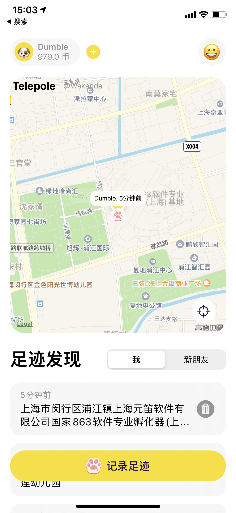

#  Telepole

## Telepole 专注于近距离社交，只关心附近的事。

### 功能
- [x] 呈现你附近的宠物；
- [x] 进入宠物详情；
- [ ] “地盘”功能；
- [ ] 寻找功能，使用UWB技术确定方位和距离。

## Bug 汇总
- [ ] 输入法不能自动退出状态；
- [ ] Logo；
- [ ] 后台模拟数据；
- [ ] 画面比例调节；

## REST-API
- 查找所有的宠物：
    https://app.wakanda.vip/rest-api/v1.0/Pets/
- 查找指定的宠物：
    https://app.wakanda.vip/rest-api/v1.0/Pets/<_id>

